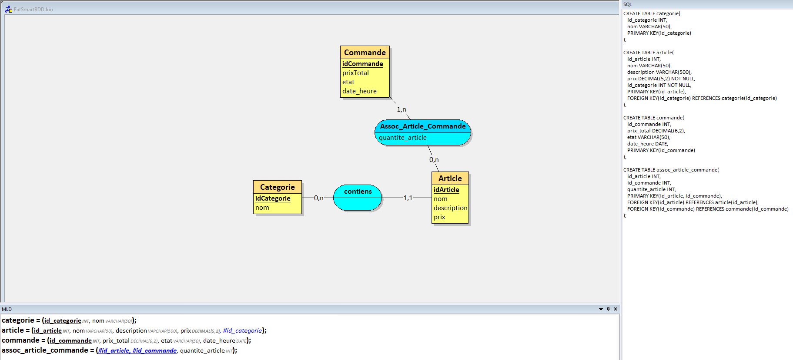

# **Projet : Eat Smart**

**Etudiant :** Evann FAVIER

---

### **1. Description du projet**

EatSmart est une application permettant aux clients de passer des commandes dans des restaurants et de se faire livrer.

---

### **3. Fonctionnalités principales**

#### **3.1 Frontend (eatSmartFront)**

- **Fonctionnalité 1 :**  
  Commander a manger
  
- **Fonctionnalité 2 :**  
  Se faire livrer
  
#### **3.2 Backend (eatSmartBack)**

- **Fonctionnalité 1 :**  
  Gestion des menus
  
- **Fonctionnalité 2 :**  
  Historique de commandes

---

### **4. Technologies utilisées**

- **Frontend :** HTML, CSS, JS, PHP
- **Backend :** PHP, API-REST
- **Base de données** : MYSQL
---

### **Creation du MCD MLD EatSmart**

## Endpoints de l'API

Adresse de l'API (en local) : http://localhost/http://localhost/evann-api-eatsmart

Voici les différents endpoints de l'API : 
- `GET /articles` → Afficher la liste des articles
- `GET /articles/{id}` → Afficher l'article avec l'id égal à {id}
- `GET /categories` → Afficher la liste des catégories
- `GET /categories/{id}` → Afficher la catégorie avec l'id égal à {id}
- `GET /commandes` → Afficher la liste des commandes
- `GET /commandes/{id}` → Afficher la commande avec l'id égal à {id}
