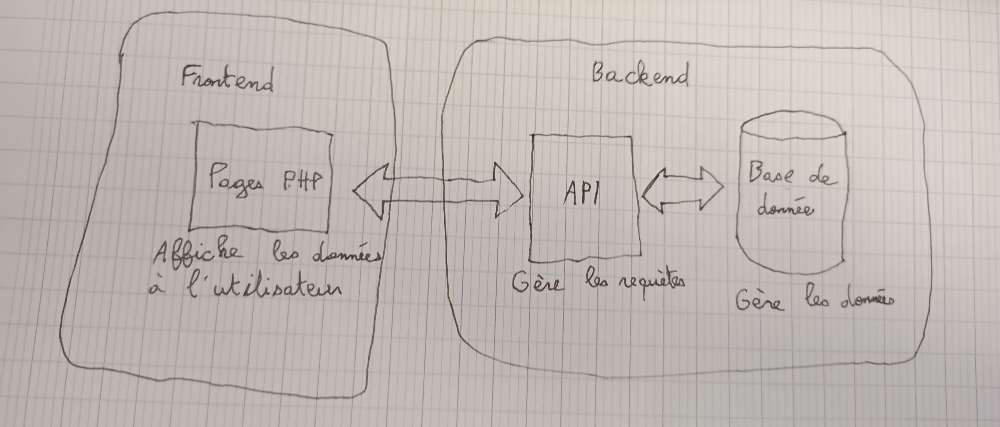

# **Projet : EatSmart**

**Etudiant :** Evann FAVIER

---

### **1. Description du projet**

EatSmart est une application permettant aux clients de passer des commandes dans des restaurants et de se faire livrer.

---

### **3. Fonctionnalités principales**

#### **3.1 Frontend (eatSmartFront)**

- **Fonctionnalité 1 :**  
  Commander a manger
  
- **Fonctionnalité 2 :**  
  Se faire livrer
  
#### **3.2 Backend (eatSmartBack)**

- **Fonctionnalité 1 :**  
  Gestion des menus
  
- **Fonctionnalité 2 :**  
  Historique de commandes

---

### **4. Technologies utilisées**

- **Frontend :** Html, css, js, php
- **Backend :** PHP, API-REST
- **Base de données : MySQL
---
